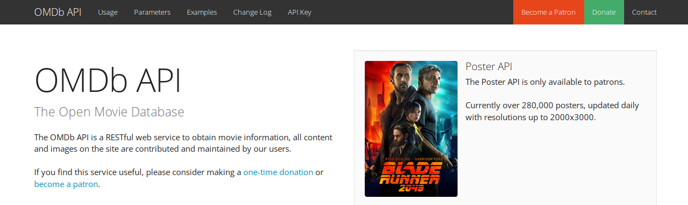
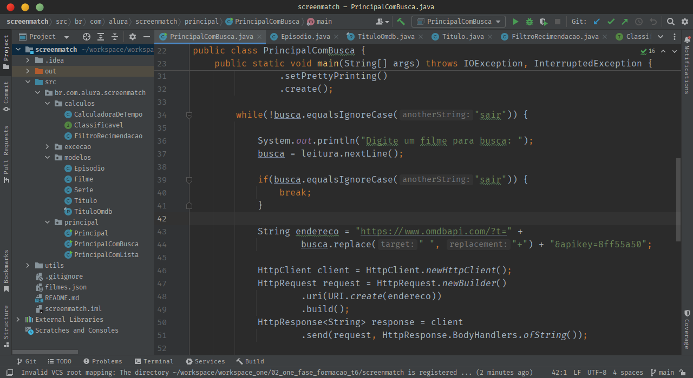

# Java: Consumindo API, Gravando Arquivos e Lidando com Erros

Neste projeto, exploramos a integração da API do [OMDb](https://www.omdbapi.com) para acessar informações sobre filmes e séries. Utilizamos a biblioteca [Gson](https://github.com/google/gson) para facilitar o consumo dos dados JSON fornecidos pela API. Além disso, aprendemos como adicionar dependências ao projeto, enriquecendo nossa compreensão sobre gerenciamento de bibliotecas e facilitando a integração de novos recursos.

  

 

Neste projeto, além de explorarmos a integração da API do [OMDb](https://www.omdbapi.com) e o uso da biblioteca [Gson](https://github.com/google/gson), também aplicamos conceitos de Programação Orientada a Objetos (POO). Criamos classes e interfaces para estruturar o projeto de forma mais organizada e modular, promovendo uma arquitetura mais escalável e de fácil manutenção.

Além disso, aprofundamos nosso entendimento sobre tratamento de exceções em Java, garantindo uma maior robustez ao lidar com situações inesperadas durante a execução do programa. Utilizamos blocos try-catch para capturar e lidar com exceções de forma adequada.

Outro aspecto importante foi a utilização da classe FileWriter para salvar os dados obtidos da API em arquivos no formato JSON. Isso nos permitiu armazenar localmente as informações recuperadas, possibilitando análises posteriores e a criação de funcionalidades adicionais baseadas nos dados salvos.

 

  

 

### Certificado 

  

