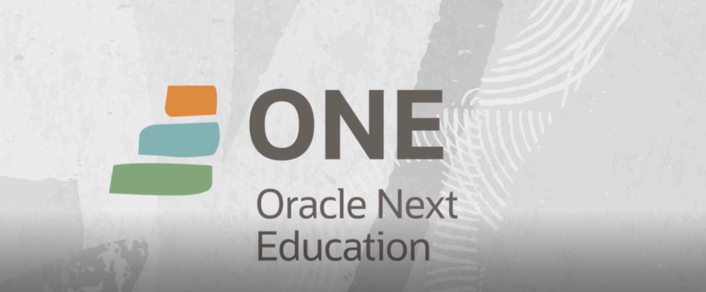

 

 
 
  
  
  

  
  

 

  

   &
  

    <a href="#roadmap">Roadmap</a>
  • <a href="#techs">Tecnologias</a> 
  • <a href="#challenge">Desafios</a>

  

# ONE - Oracle Next Education

## A tecnologia é para todas as pessoas

Manual dos Candidatos ONE
Antes de se inscrever, conheça a jornada completa e todas as informações das atividades do programa por meio do Manual dos Candidatos ONE.

O ONE é um programa de educação e empregabilidade com objetivo social de capacitar pessoas em tecnologia e conectá-las com o mercado de trabalho por meio de empresas parceiras.

O curso é 100% online e totalmente gratuito, feito para quem não teve acesso à educação de qualidade e deseja transformar a sua realidade social.

## ONE | Fase 1: Inscrição
O primeiro passo para quem tem interesse em concorrer a uma bolsa no ONE é se inscrever pelo site do programa, <a href="https://www.oracle.com/br/education/oracle-next-education/" target="_blank">Link do site</a>.

## ONE | Fase 2: Seleção
Ao se inscreverem, os candidatos ganham acesso à plataforma do ONE por dois meses para conhecerem a metodologia do programa e finalizarem as primeiras formações em Lógica de Programação e Desenvolvimento Pessoal.

<h3>Roadmap</h3>

<ul>
    <h4>Legenda:</h4>
    <li>📜 -> Artigos</li>
    <li>👨‍💻 -> Cursos</li>
    <li>🎬 -> Vídeos </li>
  </ul>

 
  <ul>
    <h3>Desenvolvimento Pessoal T6 - ONE</h3>
    
Aprenda como melhorar a sua produtividade e seu desenvolvimento pessoal

    <em>Aprender a aprender</em>
     
    <li>📜 <a href="https://www.alura.com.br/artigos/04-dicas-do-gui-silveira-para-aprender-a-aprender">04 pontos essenciais que o Gui Silveira já nos ensinou para aprender</a></li>
    <li>👨‍💻 <a href="https://cursos.alura.com.br/course/aprender-a-aprender-tecnicas-para-seu-autodesenvolvimento">Aprender a aprender: técnicas para seu autodesenvolvimento</a></li>
    <li>📜 <a href="https://www.alura.com.br/artigos/planejando-meus-estudos">Planejando meus estudos</a></li>
  </ul>
   
  
  <ul>
    <em>Turbine seu LinkedIn</em>
     
    <li>👨‍💻 <a href="https://cursos.alura.com.br/course/linkedin-perfil-trabalhar-voce">LinkedIn: como fazer o seu perfil trabalhar para você</a></li>
  </ul>
   

  <ul>
    <em>Foco no dia a dia</em>
     
    <li>👨‍💻 <a href="https://cursos.alura.com.br/course/foco-o-poder-do-habito-seu-dia-a-dia">Foco: trazendo mais resultados para o dia a dia </a></li>
    <li>📜 <a href="https://www.alura.com.br/artigos/tecnica-pomodoro">Técnica Pomodoro: gerencie seu tempo com simplicidade | Alura Curso </a></li>
    <li>🎬 <a href="https://youtu.be/7FhnS4SLc4k?si=yntveLCRS8lmmZym">Controle seu foco, aumente sua produtividade - YouTube </a></li>
    <li>🎬 <a href="https://www.youtube.com/watch?v=V0FuAukFSzc&t=6s">Como é o trabalho remoto? #HipstersPontoTube - YouTube </a></li>
    <li>📜 <a href="https://www.alura.com.br/artigos/planejando-meus-estudos">Planejando meus estudos | Alura Cursos Online </a></li>
  </ul>
   

  <ul>
    <em>Comece pelos seus hábitos</em>
     
    <li>📜 <a href="https://www.alura.com.br/artigos/estudar-todos-os-dias-e-o-que-mais-as-dicas-do-aluno-alura-eduardo-branquinho">Estudar todos os dias, e o que mais? As dicas do Aluno Alura Eduardo </a></li>
    <li>👨‍💻 <a href="https://cursos.alura.com.br/course/habitos">Hábitos: da produtividade às metas pessoais </a></li>
    <li>🎬 <a href="https://www.youtube.com/watch?v=yfcgz3Ivs6g">Alura Live #51 - Hábitos: como ser mais produtivo? - YouTube </a></li>
    <li>📜 <a href="https://www.alura.com.br/artigos/habitos-como-melhora-los">Hábitos: Como melhorá-los | Alura Cursos Online </a></li>
    <li>🎬 <a href="https://www.youtube.com/watch?v=a84Hd9c1_sw">Hábitos de estudos - Alura Live #48 - YouTube </a></li>
  </ul>
   

---

  <ul>
    <h3>Iniciante em Programação T6 - ONE</h3>
    
O caminho das pedras para entrar no universo da programação e começar com a criação de sites utilizando as linguagens populares CSS, HTML e JavaScript.

    <em>Aprenda lógica de programação</em>
     
    <li>📜 <a href="https://www.alura.com.br/artigos/5-duvidas-de-quem-quer-iniciar-na-carreira-de-programacao">5 dúvidas de quem quer iniciar na carreira de programação</a></li>
    <li>🎬 <a href="https://cursos.alura.com.br/course/logica-programacao-mergulhe-programacao-javascript">Lógica de programação: mergulhe em programação com JavaScript</a></li>
    <li>🎬 <a href="https://cursos.alura.com.br/course/logica-programacao-funcoes-listas">Lógica de programação: explore funções e listas</a></li>
    <li>📜 <a href="https://www.alura.com.br/artigos/visualstudio-code-instalacao-teclas-de-atalho-plugins-e-integracoes">VisualStudio Code: instalação, teclas de atalho, plugins e integrações</a></li>
  </ul>
  <ul>
    <em>Crie suas primeiras páginas web</em>
     
    <li>📜 <a href=" "> ... </a></li>
  </ul>

   

### ONE | Fase 3 - Especialização Back-End

#### ***Formações técnicas e Soft Skills***

Aluno ONE Back-End com formação técnica junto com Soft Skills.

  <ul>
    <h3>Java e Spring Framework T6 - ONE</h3>
    
Crie modernas aplicações web Java com o Spring Boot. Aprenda a programar desde o acesso ao banco de dados, com Postgres, MySQL e JPA, até a criação de uma API REST, tudo com o framework mais popular do mundo Java..

    <em>Java Web e banco de dados</em>
     
    <ul>
    <em>Java: trabalhando com lambdas, streams e Spring Framework</em>
     
    <li>👨‍💻 <a href="./02_one_fase_formacao_t6/Java_e_Spring_Framework_T6_ONE/screenmatch/">Projeto 1 >> Consumindo API - - ScreenMatch</a></li>
    <li>👨‍💻 <a href="./02_one_fase_formacao_t6/Java_e_Spring_Framework_T6_ONE/TabelaFipe/">Projeto 2 >> Consumindo API - TabelaFipe</a></li>
  </ul>
  <ul>
    <em>Java: persistência de dados e consultas com Spring Data JPA
</em>
     
    <li>👨‍💻 <a href=" "> ... </a></li>
  </ul>
   
  <ul>
    <em>Java: criando sua primeira API e conectando ao front</em>
     
    <li>👨‍💻 <a href=" "> ... </a></li>
  </ul>
   
  <em>Aceite o desafio construa seu Literalura</em>
  <ul>
    <em>Praticando Spring Boot: Challenge LiterAlura</em>
     
    <li>👨‍💻 <a href=" "> ... </a></li>
  </ul>
   
  <em>API REST com Spring Boot 3</em>
  <ul>
    <em>Spring Boot 3: desenvolva uma API Rest em Java</em>
     
    <li>👨‍💻 <a href=" "> ... </a></li>
     
    <em>Spring Boot 3: aplique boas práticas e proteja uma API Rest</em>
     
    <li>👨‍💻 <a href=" "> ... </a></li>
     
    <em>Spring Boot 3: documente, teste e prepare uma API para o deploy</em>
     
    <li>👨‍💻 <a href=" "> ... </a></li>
  </ul>
   
   
  <em>Aceite o desafio construa seu próprio Fórum</em>
  <ul>
    <em>Praticando Spring Framework: Challenge Fórum Hub</em>
     
    <li>👨‍💻 <a href=" "> ... </a></li>
  </ul>
   

### Fase 4: AlumniONE
E depois de formados, ainda podem fazer parte do AlumniONE, nossa comunidade de ex-alunos que oferece benefícios e mais de 200 horas de trilhas Oracle exclusivas.

# Certificado

  

---

<h3  id="id9">🎥 Rede Social</h3>

  

